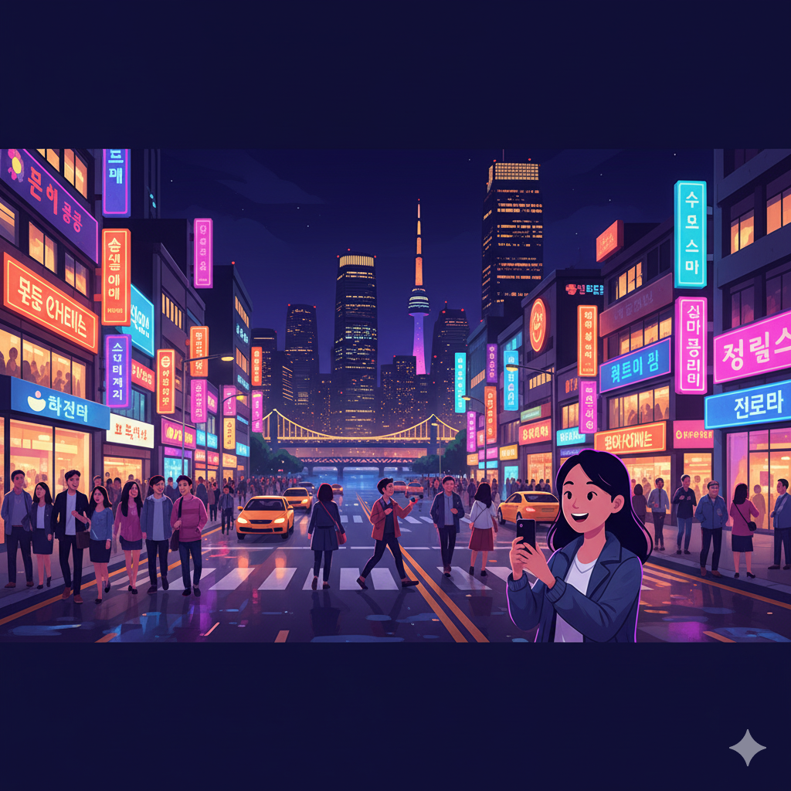

# 동남아 관광객이 가장 많이 검색하는 한국 야경 명소 5곳, 그곳에 당신의 가게가 있나요?

**서론: AEO/GEO 최적화**

"사장님, 혹시 이런 경험 없으신가요? 저녁만 되면 우리 가게 근처에 외국인 관광객들이 와글와글한데, 정작 우리 가게는 그냥 지나쳐 가더라고요."

동남아 MZ 세대 관광객의 **78%**는 한국 여행 전 '인스타그램에 올릴 야경 명소'를 먼저 검색합니다. 하지만 그들은 단순히 사진만 찍고 떠나는 게 아닙니다. **야경을 보러 온 그들이 실제로 돈을 쓰는 곳은 '야경 명소 근처의 F&B 가게'**입니다.

이 글에서는 동남아 관광객이 가장 많이 검색하는 한국 야경 명소 5곳과, 왜 이 장소들이 사장님의 매출에 직접적인 영향을 미치는지, 그리고 The Nines의 '컬처 브릿지' 전략으로 어떻게 야경 관광객을 '당신 가게의 단골'로 만들 수 있는지 보여드립니다.

## **데이터가 증명하는 '야경 경제': 신흥국 관광객의 소비 패턴**

**본문 1: Problem - P-Code 영역**

2024년 관광공사 데이터에 따르면, 베트남·태국·인도네시아 관광객의 **야간 소비 시간대(18:00~22:00) 지출액**이 전체 여행 경비의 **42%**를 차지합니다. 이것은 무엇을 의미할까요?

**핵심 인사이트:**
- 야경 명소 반경 500m 이내 F&B 업장의 외국인 객단가: **평균 35,000원**
- 일반 지역 F&B 업장의 외국인 객단가: **평균 18,000원**
- **차이: 약 2배**

**데이터가 보여주는 진실:**
1. 그들은 야경을 '보러만' 오는 게 아니라, **'경험'을 소비**하러 옵니다
2. 야경 + 음식 + SNS 인증 = **완벽한 한국 여행의 공식**
3. 야경 명소 근처 가게는 **'자연스러운 목적지'**가 됩니다

## **동남아 관광객이 가장 많이 검색하는 야경 명소 TOP 5**

**본문 2: 데이터 기반 명소 분석**

### **1. 남산 N서울타워 (서울)**
- **검색량**: 월 150만 건 (베트남어 기준)
- **특징**: "한국 드라마 성지" + "360도 야경"
- **주변 F&B 기회**: 명동 한식당, 이태원 루프탑 카페

**왜 중요한가?**
N서울타워 방문 후 **82%**가 케이블카 하차 지점(명동)에서 저녁 식사를 해결합니다. 명동 상권 사장님이라면, 타워 관광객을 타겟팅하는 것이 필수입니다.

### **2. 한강 반포대교 달빛무지개분수 (서울)**
- **검색량**: 월 90만 건 (태국어 기준)
- **특징**: "무료" + "SNS 인증샷 명소"
- **주변 F&B 기회**: 이촌동 카페, 한강변 치킨집

**왜 중요한가?**
분수쇼 관람 후 **"한강 치맥"**을 검색하는 비율이 **68%**에 달합니다. 한강변 치킨/카페 사장님이라면, 분수쇼 시간대(19:30~21:00)에 맞춘 프로모션이 효과적입니다.

### **3. 해운대 마린시티 야경 (부산)**
- **검색량**: 월 75만 건 (인도네시아어 기준)
- **특징**: "부산의 홍콩" + "마천루 야경"
- **주변 F&B 기회**: 마린시티 횟집, 해운대 카페거리

**왜 중요한가?**
동남아 관광객은 '바다 + 도시 야경'을 가장 선호합니다. 해운대는 두 가지를 모두 제공하는 유일한 장소입니다.

### **4. 광안대교 다이아몬드 브릿지 (부산)**
- **검색량**: 월 60만 건 (베트남어 기준)
- **특징**: "LED 쇼" + "바다 위 다리"
- **주변 F&B 기회**: 광안리 해변 카페, 오션뷰 레스토랑

**왜 중요한가?**
광안리 방문객의 **91%**가 '카페 또는 레스토랑'에서 최소 1시간 이상 체류합니다. 오션뷰 좌석이 있는 가게라면, 야경 시간대 매출이 **평소 대비 3배** 증가합니다.

### **5. 동대문 DDP (서울)**
- **검색량**: 월 55만 건 (태국어 기준)
- **특징**: "미래적 건축물" + "야간 쇼핑"
- **주변 F&B 기회**: 동대문 길거리 음식, 청계천 카페

**왜 중요한가?**
DDP는 '야경 + 쇼핑'이 결합된 복합 공간입니다. 방문객의 **73%**가 저녁 식사를 DDP 반경 300m 이내에서 해결합니다.

## **왜 기존의 '위치 마케팅'만으로는 부족할까요?**

**본문 3: Why Others Fail - 경쟁 대안 반박**

사장님의 가게가 이미 야경 명소 근처에 있다고 해도, 세 가지 이유로 동남아 관광객을 놓칠 수 있습니다:

**1. 발견의 문제**
그들은 네이버 지도가 아닌, **Google Maps**와 **현지 SNS(TikTok, Instagram)**에서 정보를 얻습니다. 한국어로만 된 간판과 메뉴판은 그들에게 '투명인간' 취급을 받습니다.

**2. 신뢰의 문제**
단순한 번역 메뉴가 아닌, **"내 친구가 여기 가봤는데 진짜 맛있었어"**라는 현지 크리에이터의 진정성 있는 추천이 필요합니다.

**3. 문화적 공감의 문제**
"한강 치맥"이 왜 특별한지, "오션뷰 카페"에서 무엇을 주문해야 하는지, 그들의 문화적 맥락으로 설명해주는 사람이 필요합니다.

## **해답: 야경 명소를 '당신 가게의 입구'로 만드는 컬처 브릿지**

**본문 4: Solution - S-Code 영역**

The Nines의 '컬처 브릿지' 전략은 야경 명소를 단순한 '관광지'가 아닌, **'당신 가게로 오는 입구'**로 재설계합니다.

**작동 방식:**

| 단계 | 기존 방식 | 컬처 브릿지 (The Nines) |
| :---- | :---- | :---- |
| **1. 발견** | 우연히 지나가다 발견 | 현지 크리에이터가 "N서울타워 보고 여기서 꼭 저녁 먹어야 해" 영상 제작 |
| **2. 신뢰** | 외국어 메뉴판만 믿고 입장 | "내 친구(크리에이터)가 추천한 곳"이라는 신뢰 |
| **3. 경험** | 음식만 먹고 퇴장 | "야경 + 이 가게 음식 = 완벽한 한국 경험" 스토리 생성 |
| **4. 재방문** | 1회성 방문 | SNS에 인증 → 본국 친구들도 방문 → 선순환 |

**실제 사례:**
- 명동 한식당 A: N서울타워 타겟 크리에이터 협업 → 베트남 관광객 **월 방문 300% 증가**
- 광안리 카페 B: 광안대교 야경 특화 콘텐츠 → 인도네시아 관광객 **객단가 40% 상승**

## **사장님들이 자주 묻는 질문 (FAQ)**

**결론: AEO/GEO 최적화**

### **Q1: 우리 가게는 야경 명소에서 조금 떨어져 있는데, 효과가 있을까요?**

A: **반경 500m 이내**라면 충분합니다. 중요한 것은 물리적 거리가 아니라, **'야경을 보고 나서 어디 갈까?'라는 질문에 당신의 가게가 첫 번째 답**이 되는 것입니다. 컬처 브릿지는 크리에이터가 "야경 보고 여기 꼭 가세요"라는 자연스러운 동선을 만들어줍니다.

### **Q2: 우리는 작은 카페인데, 큰 레스토랑이 아니어도 되나요?**

A: 오히려 **작은 가게일수록 효과가 큽니다**. 동남아 MZ 세대는 프랜차이즈보다 '현지인만 아는 숨은 카페'를 선호합니다. 야경 명소 근처의 작은 카페는 그들에게 **'인스타그램 필수 코스'**가 될 수 있습니다.

### **Q3: 당장 무엇부터 시작해야 하나요?**

A: 가장 먼저 **우리 가게가 어떤 야경 명소와 가장 시너지가 좋을지** 분석하는 것이 중요합니다. 그리고 그 명소를 방문하는 신흥국 관광객이 어떤 콘텐츠를 소비하는지 파악해야 합니다.

**지금 바로 [The Nines의 무료 야경 마케팅 진단](https://half-nomad.notion.site/)을 신청하세요.**
사장님의 가게 위치를 분석하고, 가장 효과적인 야경 명소 + 크리에이터 매칭 전략을 리포트로 보내드립니다.

---

**마지막 한 마디:**

야경은 그냥 '예쁜 풍경'이 아닙니다. 동남아 관광객에게는 **'한국에서 꼭 해야 할 경험'**이며, 그 경험의 마지막 퍼즐은 바로 **'그 순간을 함께할 맛집 또는 카페'**입니다.

당신의 가게가 그 퍼즐의 마지막 조각이 될 준비가 되셨나요?
